# Awesome-Cyber-Asset-Attack-Surface-Management

<div align="center">

<p align="center">
  
</p>

<a href="https://github.com/ishandutta2007/Awesome-Awesome-Awesome"></a><a href="https://discord.gg/jc4xtF58Ve"></a><a href="https://github.com/ishandutta2007/Awesome-Cyber-Asset-Attack-Surface-Management/stargazers"></a><a href="https://github.com/ishandutta2007/Awesome-Cyber-Asset-Attack-Surface-Management/network/members"></a><a href="https://github.com/ishandutta2007/Awesome-Cyber-Asset-Attack-Surface-Management/issues"></a><a href="https://github.com/ishandutta2007/Awesome-Cyber-Asset-Attack-Surface-Management/blob/main/LICENSE"></a><a href="https://github.com/ishandutta2007/Awesome-Cyber-Asset-Attack-Surface-Management/pulls"></a><a href="https://github.com/ishandutta2007"></a>

<p align="center">
  <b>🌐 Comprehensive curated guide to Cyber Asset Attack Surface Management (CAASM), External Attack Surface Management (EASM), Exposure Management, and Cyber Asset Discovery tools.</b>
</p>

</div>

---

## 📑 Table of Contents

- [🌟 Introduction & CAASM Overview](#-introduction--caasm-overview)
- [🏢 SaaS / Commercial CAASM Platforms](#-saas--commercial-caasm-platforms)
- [🔓 Open-Source GitHub Projects](#-open-source-github-projects)
- [🏗️ Recommended Open-Source Architectural Stacks](#️-recommended-open-source-architectural-stacks)
- [🧠 Core CAASM Concepts & Functional Domains](#-core-caasm-concepts--functional-domains)
- [🤝 How to Contribute](#-how-to-contribute)
- [⭐ Star History](#-star-history)
- [📄 Disclaimer & License](#-disclaimer--license)

---

## 🌟 Introduction & CAASM Overview

**Cyber Asset Attack Surface Management (CAASM)** is an emerging security domain dedicated to solving persistent visibility and vulnerability gaps across modern hybrid environments. CAASM platforms continuously aggregate, correlate, and normalize asset telemetry across disparate systems—spanning endpoints, cloud workloads, SaaS applications, identity providers, network infrastructure, CI/CD pipelines, and OT/IoT devices.

```mermaid
flowchart LR
    subgraph Ingestion["🔌 Ingestion & Discovery Sources"]
        Cloud["☁️ Multi-Cloud (AWS, Azure, GCP)"]
        Endpoints["💻 Endpoints & MDM (EDR, Osquery)"]
        Identity["🔑 IAM & IdPs (Okta, Entra ID)"]
        Network["🌐 Network Scanners & IPAM"]
        SaaS["📱 SaaS & Code Repos (GitHub, Jira)"]
    end

    subgraph Core["⚙️ CAASM Core Engine"]
        Normalize["🔄 Normalization & Deduplication"]
        Graph["🕸️ Cyber Asset Graph"]
        Gap["⚠️ Control Gap & Exposure Analysis"]
    end

    subgraph Actions["🚀 Remediation & Action"]
        SOAR["🤖 Automated SOAR Playbooks"]
        SIEM["📊 SIEM / SOC Telemetry"]
        Ticket["🎫 ITSM & Jira Ticketing"]
    end

    Ingestion --> Core --> Actions
```



### 🎯 Key Benefits of CAASM:
- 🔍 **Eliminate Blind Spots:** Detect unmanaged, rogue, and shadow-IT devices missing security agents (EDR, vulnerability scanners, MDM).
- 🔄 **Automate Inventory:** Maintain a dynamic, real-time single source of truth for assets, replacing static spreadsheets.
- 🛡️ **Continuous Controls Monitoring (CCM):** Instantly identify compliance drift, expired certificates, unencrypted buckets, and inactive user credentials.
- ⚡ **Prioritize Exposures:** Connect vulnerability intelligence with real asset context, business criticality, and network blast radius.

---

## 🏢 SaaS / Commercial CAASM Platforms

The following commercial CAASM and cyber exposure platforms are sorted in descending order by **Company Size (Valuation / Market Capitalization / Annual Revenue)**.

| Platform | Company Size (Valuation / Revenue) | Description | Starting Pricing | Free Tier / Free Trial Limits |
| :--- | :--- | :--- | :--- | :--- |
| **[Tanium](https://www.tanium.com/)** | **~$9.0B Valuation**<br>*(>$700M ARR)* | 🛡️ Real-time endpoint visibility, asset inventory, vulnerability management, configuration assessment, and SecOps platform. | Starts at ~$20–$24/endpoint/year (~$10,000/year minimum entry platform commitment) | 14-day to 30-day free trial / interactive hands-on lab environment |
| **[Armis](https://www.armis.com/)** | **~$7.75B Valuation**<br>*(>$300M ARR; Acquired by ServiceNow)* | 🌐 Asset intelligence and cyber exposure management platform specialized in unmanaged devices, IoT, OT, IoMT, and cyber-physical systems. | Starts at ~$3,250/month ($39,000/year minimum platform entry floor via AWS Marketplace) | 14-day to 30-day guided interactive trial / Proof of Concept (PoC) |
| **[Qualys CyberSecurity Asset Management](https://www.qualys.com/solutions/attack-surface-management)** | **~$6.8B Market Cap**<br>*(~$735M Revenue; NASDAQ: QLYS)* | 🔎 Discovers, categorizes, and manages known and unknown hybrid IT assets using agents, passive sensors, cloud connectors, and external attack surface management. | Starts at ~$10,870/year (entry tier for up to 1,000 assets / ~$10.87 per asset/year) | 30-day free trial with full CSAM asset inventory & external exposure detection |
| **[Axonius](https://www.axonius.com/)** | **~$2.6B Valuation**<br>*(>$200M ARR)* | 🧩 Cyber Asset Management and CAASM platform aggregating data from security, IT, cloud, endpoint, identity, and infrastructure tools to provide unified asset visibility and detect security control gaps. | Starts at ~$35,000/year (~$25–$50 per asset/year for entry-level deployments) | 30-day free trial with full platform connector integrations and asset discovery |
| **[Orca Security](https://orca.security/)** | **~$1.8B Valuation**<br>*(~$65M ARR)* | ☁️ Agentless cloud security and CAASM platform providing cloud asset discovery, vulnerability management, CSPM, and attack path analysis across multi-cloud environments. | Starts at ~$3,000/month ($36,000/year all-inclusive single SKU entry tier based on cloud workloads) | 30-day free trial / cloud risk assessment via AWS Marketplace SideScanning |
| **[JupiterOne](https://www.jupiterone.com/)** | **~$1.0B+ Valuation**<br>*(~$12M ARR)* | 🕸️ Graph-based CAASM and cyber risk platform mapping asset relationships, coverage gaps, policy-as-code, and cross-domain security queries across cloud, code, and identities. | Starts at ~$500/month ($6,000/year) based on asset data point ingestion tiers | 14-day to 30-day free trial / guided Proof of Value (POV) |
| **[Noetic Cyber](https://noeticcyber.com/)** *(Rapid7 Surface Command)* | **~$850M Market Cap**<br>*(~$860M Revenue; NASDAQ: RPD)* | ⚙️ Cyber asset management and continuous controls monitoring platform aggregating IT and security telemetry to uncover asset relationships and control gaps. | Starts at ~$1.93/asset/month (~$11,580/year for 500-asset minimum entry tier via Rapid7 Command) | 30-day free trial via Rapid7 platform evaluation |
| **[runZero](https://www.runzero.com/)** | **~$300M+ Valuation**<br>*(Venture-backed, $60M+ raised)* | 📡 Network-centric asset discovery combining active network scanning, passive discovery, and fingerprinting for IT, OT, IoT, and remote environments. | Free tier available; Paid platform starts at $5,000/year (up to 1,000 assets) | **Free forever Community Edition** up to 100 assets (with 10 recurring tasks & 30-day retention); includes 21-day full platform trial upon signup |
| **[Panaseer](https://panaseer.com/)** | **~$100M–$150M Est.**<br>*($93M Total Funding Raised)* | 📊 Continuous controls monitoring and cyber asset platform correlating security telemetry, establishing trusted inventories, and measuring control coverage. | Starts at ~$50,000/year for entry-level enterprise deployment | 30-day guided Proof of Concept (PoC) & Controls Assurance Workshop |

---

## 🔓 Open-Source GitHub Projects

Curated open-source projects for asset discovery, endpoint inventory, external reconnaissance, cloud inventory, vulnerability correlation, and cyber exposure graphs. Repositories are sorted in **descending order by GitHub Stars ⭐**.

1. **[Trivy](https://github.com/aquasecurity/trivy)** [](https://github.com/aquasecurity/trivy/stargazers)  
   🛡️ Comprehensive vulnerability, misconfiguration, secret, and SBOM scanner for containers, Kubernetes clusters, code repositories, and cloud workloads.

2. **[Nuclei](https://github.com/projectdiscovery/nuclei)** [](https://github.com/projectdiscovery/nuclei/stargazers)  
   ⚡ Fast, template-based vulnerability and attack-surface scanner for detecting zero-days, CVEs, misconfigurations, and technology exposures across assets.

3. **[osquery](https://github.com/osquery/osquery)** [](https://github.com/osquery/osquery/stargazers)  
   💻 SQL-powered operating system instrumentation framework that treats endpoints as relational databases for live software inventory, configuration auditing, and compliance.

4. **[NetBox](https://github.com/netbox-community/netbox)** [](https://github.com/netbox-community/netbox/stargazers)  
   🗄️ Leading source of truth and IPAM/DCIM platform for modeling physical hardware, virtual machines, cloud instances, VLANs, and network topology.

5. **[Katana](https://github.com/projectdiscovery/katana)** [](https://github.com/projectdiscovery/katana/stargazers)  
   🕷️ Next-generation web crawler and asset endpoint discovery framework designed to enumerate hidden URLs, APIs, and attack surfaces.

6. **[Wazuh](https://github.com/wazuh/wazuh)** [](https://github.com/wazuh/wazuh/stargazers)  
   🛡️ Open-source unified XDR, SIEM, and endpoint security platform delivering continuous software inventory, vulnerability assessment, and compliance telemetry.

7. **[OWASP Amass](https://github.com/owasp-amass/amass)** [](https://github.com/owasp-amass/amass/stargazers)  
   🛰️ In-depth attack surface mapping and external asset discovery framework using active reconnaissance, DNS enumeration, and OSINT harvesting.

8. **[Prowler](https://github.com/prowler-cloud/prowler)** [](https://github.com/prowler-cloud/prowler/stargazers)  
   ☁️ Leading multi-cloud security assessment tool for AWS, Azure, GCP, and Kubernetes asset discovery, compliance monitoring, and exposure remediation.

9. **[Subfinder](https://github.com/projectdiscovery/subfinder)** [](https://github.com/projectdiscovery/subfinder/stargazers)  
   🔎 High-speed passive subdomain discovery tool designed to map external organizational asset infrastructure without sending active traffic to targets.

10. **[Nmap](https://github.com/nmap/nmap)** [](https://github.com/nmap/nmap/stargazers)  
    🌐 The industry-standard network exploration and port scanning utility for discovering active devices, open ports, OS fingerprinting, and running services.

11. **[httpx](https://github.com/projectdiscovery/httpx)** [](https://github.com/projectdiscovery/httpx/stargazers)  
    🚀 Fast and multi-purpose HTTP toolkit allowing multi-probe testing for TLS certificates, status codes, technology stacks, and web server banners.

12. **[Steampipe](https://github.com/turbot/steampipe)** [](https://github.com/turbot/steampipe/stargazers)  
    📊 Zero-ETL SQL engine that queries live cloud APIs, SaaS services, identity directories, and code repositories directly as relational SQL tables.

13. **[Fleet](https://github.com/fleetdm/fleet)** [](https://github.com/fleetdm/fleet/stargazers)  
    🖥️ Open-source endpoint management and osquery manager providing real-time fleet-wide device inventory, software monitoring, and patch verification.

14. **[CloudQuery](https://github.com/cloudquery/cloudquery)** [](https://github.com/cloudquery/cloudquery/stargazers)  
    🔄 High-performance open-source data integration framework that extracts cloud and security configurations and loads them into PostgreSQL, ClickHouse, or Snowflake.

15. **[Naabu](https://github.com/projectdiscovery/naabu)** [](https://github.com/projectdiscovery/naabu/stargazers)  
    ⚡ Extremely fast Go-based port scanner designed for reliability, simplicity, and active SYN/CONNECT network discovery pipelines.

16. **[Recon-ng](https://github.com/lanmaster53/recon-ng)** [](https://github.com/lanmaster53/recon-ng/stargazers)  
    🕵️ Modular Web Reconnaissance framework providing open-source intelligence gathering and asset harvesting through an interactive CLI environment.

17. **[ThreatMapper](https://github.com/deepfence/ThreatMapper)** [](https://github.com/deepfence/ThreatMapper/stargazers)  
    📈 Open-source CNAPP and exposure management platform that dynamically discovers cloud assets, containers, dependencies, and attack paths.

18. **[OpenVAS Scanner](https://github.com/greenbone/openvas-scanner)** [](https://github.com/greenbone/openvas-scanner/stargazers)  
    🔍 Robust network vulnerability scanner component of Greenbone Community Edition executing thousands of daily vulnerability tests against assets.

19. **[Cartography](https://github.com/lyft/cartography)** [](https://github.com/lyft/cartography/stargazers)  
    🕸️ Python-based security tool that consolidates infrastructure assets and dependencies into an intuitive Neo4j graph for complex relationship queries.

20. **[CloudFox](https://github.com/BishopFox/cloudfox)** [](https://github.com/BishopFox/cloudfox/stargazers)  
    🦊 Command-line situational awareness tool for penetration testers and defenders to identify exploitable assets, permissions, and paths in cloud environments.

21. **[Nosey Parker](https://github.com/praetorian-inc/noseyparker)** [](https://github.com/praetorian-inc/noseyparker/stargazers)  
    🔑 High-speed secrets scanner identifying API tokens, credentials, and exposed keys within Git repositories and asset filesystems.

22. **[XORCISM](https://github.com/XORCISM-AI/XORCISM)** [](https://github.com/XORCISM-AI/XORCISM/stargazers)  
    🔗 Open-source cyber exposure management platform unifying connector ecosystems, asset inventories, and automated CVE-to-asset mapping.

23. **[OASM Connectors](https://github.com/oasm-platform/oasm-connectors)** [](https://github.com/oasm-platform/oasm-connectors/stargazers)  
    🧩 Connector ecosystem extending Open Attack Surface Management (OASM) with distributed multi-engine scanning, tech detection, and analytics.

---

## 🏗️ Recommended Open-Source Architectural Stacks

Building a custom, self-hosted CAASM platform involves pairing specialized discovery engines with centralized graph and analytics backends:

```
┌────────────────────────────────────────────────────────────────────────┐
│                        Self-Hosted CAASM Stack                         │
├────────────────────────────────────────────────────────────────────────┤
│  🔍 Discovery:       Nmap / Subfinder / httpx / CloudQuery / osquery   │
│  🔄 Normalization:   Kafka / Airflow / Python Data Pipelines           │
│  🕸️ Relationship:    Neo4j / NetBox / PostgreSQL / ClickHouse          │
│  ⚠️ Exposure:        Nuclei / Trivy / Wazuh / OpenVAS                  │
│  📊 Presentation:    Grafana / OpenSearch / Custom Web Dashboard       │
└────────────────────────────────────────────────────────────────────────┘
```

### 1. 🌐 Basic Network CAASM
- **Stack:** `Nmap` + `NetBox` + `PostgreSQL` + `Grafana`
- **Use Case:** Continuously discovers and catalogs IP addresses, open ports, device types, and subnet allocations across on-premises networks.

### 2. 💻 Endpoint-Centric CAASM
- **Stack:** `osquery` + `Fleet` + `Wazuh` + `ClickHouse`
- **Use Case:** Pulls real-time hardware, OS, installed software, patch levels, and security agent statuses across corporate workstations and servers.

### 3. 🛰️ External Attack Surface Management (EASM) Stack
- **Stack:** `Subfinder` + `Naabu` + `httpx` + `OWASP Amass` + `Nuclei` + `PostgreSQL`
- **Use Case:** Maps external-facing domains, subdomains, certificates, open services, and known software vulnerabilities.

### 4. ☁️ Cloud CAASM & Posture Graph
- **Stack:** `CloudQuery` + `Steampipe` + `Cartography` + `Neo4j`
- **Use Case:** Queries multi-cloud infrastructure via SQL and renders identity permissions, IAM relationships, and asset dependencies as a queryable graph.

### 5. 🛡️ Enterprise Exposure Management Stack
- **Stack:** `XORCISM` / `OASM` + `Nuclei` + `Trivy` + `Wazuh` + `CloudQuery` + `Neo4j` + `SOAR`
- **Use Case:** Mirrors commercial CAASM platforms by normalizing multi-vendor telemetry, correlating CVEs to business owners, and executing automated remediation workflows.

---

## 🧠 Core CAASM Concepts & Functional Domains

| Concept | Icon | Operational Objective |
| :--- | :---: | :--- |
| **Asset Discovery** | 🔎 | Identifying all known, unknown, transient, and unmanaged cyber assets across hybrid environments. |
| **Asset Normalization** | 🔄 | Standardizing heterogeneous data schemas from disparate IT/security tools into a unified asset model. |
| **Asset Deduplication** | 🧩 | Resolving overlapping identities (MAC, IP, serial, hostname, cloud ARN) to a single canonical entity. |
| **Control Gap Detection** | ⚠️ | Pinpointing assets missing critical security controls (EDR, MDM, vulnerability scanners, MFA). |
| **Continuous Monitoring** | ⏱️ | Real-time tracking of asset drift, configuration changes, and new exposure introductions. |
| **Exposure Management** | 🎯 | Combining vulnerability telemetry, exploitability data, and business criticality to prioritize risk. |
| **Attack Path Analysis** | 🕸️ | Tracing multi-hop lateral movement vectors from perimeter exposures to core crown jewels. |
| **Remediation Automation** | 🤖 | Triggering automated playbooks in SOAR, ticketing in ITSM, or isolating non-compliant assets. |

---

## 🤝 How to Contribute

Contributions are warmly welcomed! To suggest a new tool or update existing information:

1. 🍴 **Fork the repository**.
2. 🌿 **Create a new branch**: `git checkout -b add-my-tool`.
3. 📝 **Edit `README.md`**: Follow the established formatting conventions (include links, descriptions, pricing/star metrics).
4. 🚀 **Submit a Pull Request**: Include a brief rationale of the tool and why it adds value to the CAASM community.

---

## ⭐ Star History

[](https://star-history.dera.page/#ishandutta2007/Awesome-Cyber-Asset-Attack-Surface-Management&type=date&legend=top-left)

---

## 📄 Disclaimer & License

- 📖 This list is community-curated for informational and educational purposes. Inclusion does not imply official endorsement.
- ⚖️ Always ensure you possess explicit legal authorization prior to executing active discovery or vulnerability scans against any network or infrastructure.
- 📜 This repository is licensed under the [MIT License](LICENSE).
